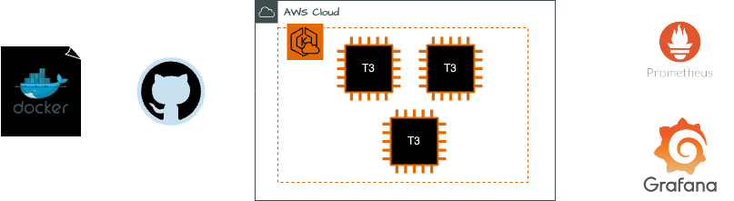
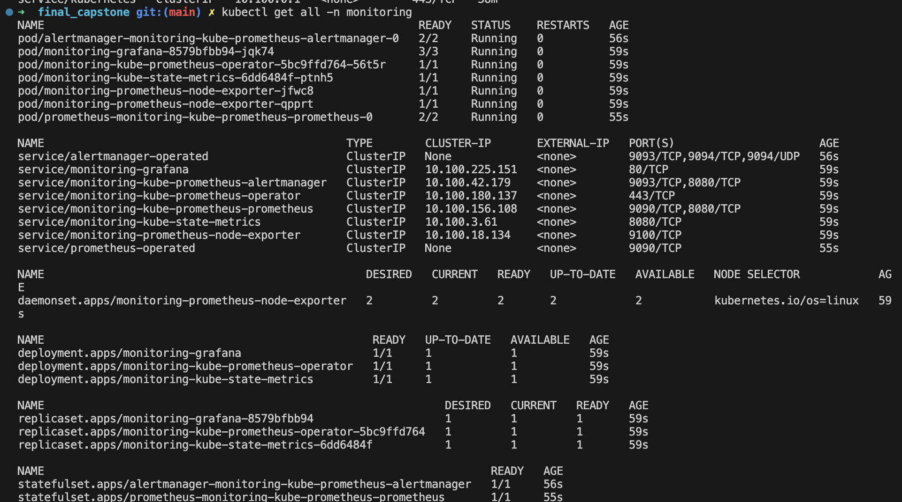
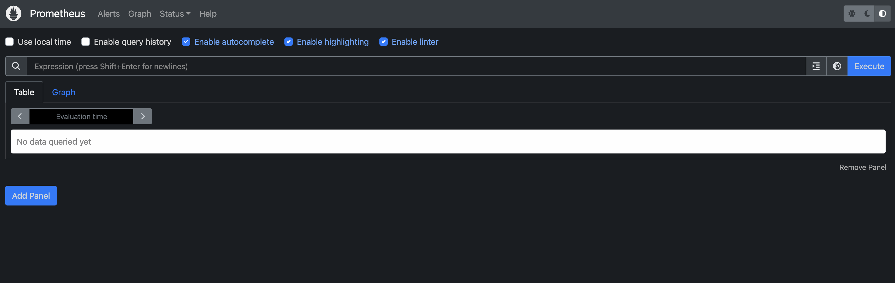
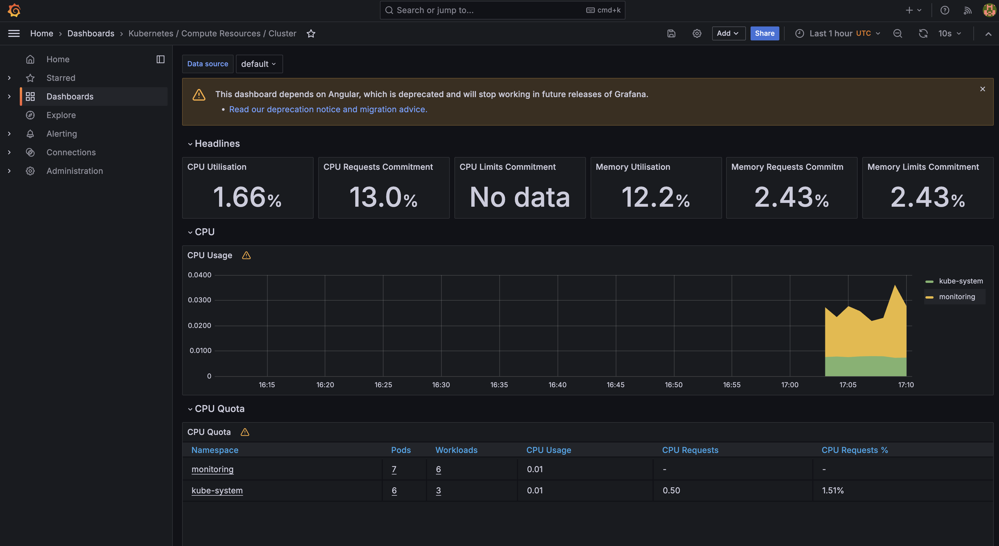
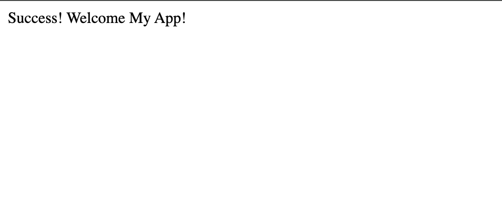
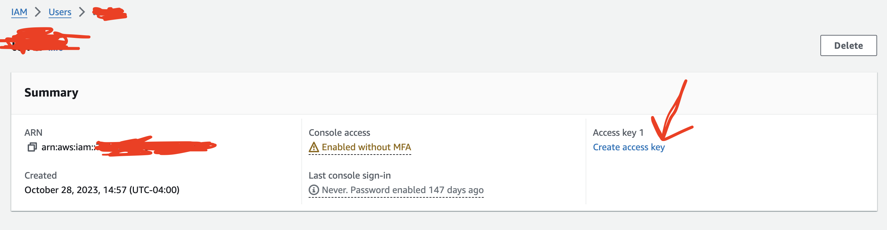
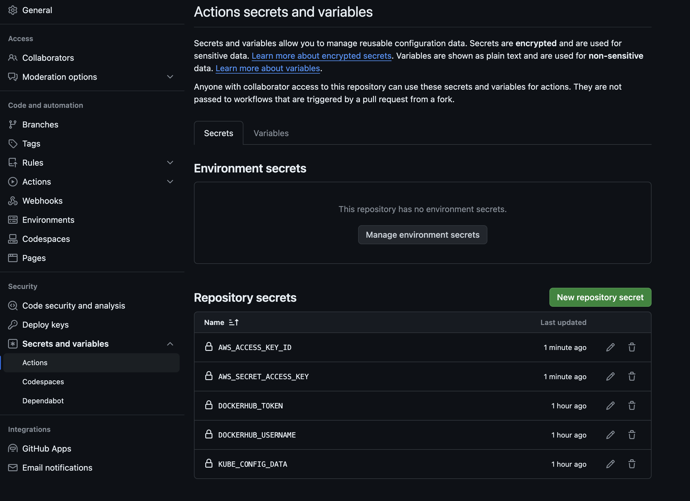

# FINAL CAPSTONE

Welcome to the Final Capstone project! This repository contains a Flask application that has been containerized and pushed to Dockerhub. The main objective is to deploy this application on an AWS EKS cluster and set up monitoring with Prometheus and Grafana.

## Architecture



## Prerequisites

Before you begin, make sure you have the following prerequisites installed on your system:

- [AWS CLI](https://docs.aws.amazon.com/cli/latest/userguide/getting-started-install.html)
- [Kubectl](https://docs.aws.amazon.com/cli/latest/userguide/getting-started-install.html)
- [Eksctl](https://eksctl.io/installation/)
- [Helm](https://helm.sh/docs/intro/install/)

Additionally, you may need:

- [Pip](https://pip.pypa.io/en/stable/installation/)
- [Python](https://docs.python.org/3/using/index.html)

## Running the Flask App Locally

To run the Flask app locally, follow these steps:

1. Install Dependencies: Install the required dependencies by running:

```sh
pip3 install -r requirements.txt
```

2. Start the Flask App: Run the following command:

```sh
python app.py
```

## Provisioning Resources on AWS EKS

We will use command line with eksctl which uses a CloufFormation template to create the eks cluster with 2 nodes. We will then update the kube config file with the information of the cluster we just created so we can interact with it. This may take up to 15 minutes.

```sh
$ eksctl create cluster --profile {yourProfile} --name wcd-capstone
$ aws eks update-kubeconfig --name wcd-capstone --region us-east-1 --profile {yourAWSCredentialProfileName}
```

## Starting the Observability Sytems

We will use a helm chart to create the prometheus monitoring. Please make sure you have helm locally available. The following command installs the chart locally and updates the helm cache.

```sh
$ helm repo add prometheus-community https://prometheus-community.github.io/helm-charts
$ helm repo update
```

Create a namespace for monitoring and install the kube prometheus stack. Finally confirm new monitoring resources have been created.

```sh
$ kubectl create ns monitoring
$ helm install monitoring prometheus-community/kube-prometheus-stack -n monitoring
$ kubectl get all -n monitoring
```



## Accessing Prometheus and Grafana Dashboards

To see the prometheus dashboard locally forward the pod port to a local port. You can visit the dashboard by going to `127.0.0.1:9090` (`localhost:9090`) on your browser.

```sh
$ kubectl port-forward service/monitoring-kube-prometheus-prometheus 9090:9090 -n monitoring
```



To see the grafana dashboard do the same. You can visit the grafana dashboard on `127.0.0.1:9090` (`localhost:8080`). Visit `Kubernetes/ Compute Resources/ Cluster` on the dashboard to see details.

```sh
$ kubectl port-forward service/monitoring-grafana 8080:80 -n monitoring
```

The default credentials for Grafana are:

- User: admin
- Password: prom-operator



## Deploying the Containerized App on AWS EKS Cluster

Please make sure you are on the right kubectl context. Add your eks context and confirm that you see you the kubernetes service.

```sh
$ kubectl config current-context
$ kubectl get all
```

Apply the kubernetes deployment and service to your cluster.

```sh
$ kubectl apply -f deployment.yaml
```

Get your load balancer external ip with `kubectl get svc`. It might take a while to setup the load balancer.

Visit the external ip on your browser or run the following command to see that there is a successful response.

```sh
$ curl {yourElbExternalIp}
```

See `Success! Welcome To My App!` on the screen.



# Continuous Integration/Continuous Deployment (CI/CD)

The repository includes a build.yaml file for CI/CD. It builds a new Docker image on push to the main branch, pushes it to Dockerhub, and restarts the deployment on the cluster.

Ensure you create the following secrets in your GitHub repository for this to work:

- DOCKERHUB_USERNAME
- DOCKERHUB_TOKEN
- KUBE_CONFIG_DATA

To get your kube config data, please run: `code ~/.kube/config`

We are also going to create a IAm Role to engage with the eks cluster and create new deployments on push to main. For the go the the IAm dashboard on your AWS account and click on "Create new user". Choose a user name attach policies directly to it and choose Admin Role (this is not recommended on a production environment).

Once the role is created create an access key for it.



Copy the key and the id to your Github secrets as well as follows:

- AWS_ACCESS_KEY_ID
- AWS_SECRET_ACCESS_KEY

Finally we need to make sure this role is in the aws-auth ConfigMap because if not we won't have the proper rights.

```sh
$ eksctl create iamidentitymapping \
    --cluster wcd-capstone \
    --region us-east-1 \
    --arn arn:aws:iam::XXXXXXXXXXXX:user/testuser \
    --group system:masters \
    --no-duplicate-arns \
    --username admin-user1
```



## How to destroy provisioned resources

To destroy provisioned resources, run the following command:

```sh
$ kubectl delete deployments - all
$ kubectl delete pods — all
$ kubectl delete services — all
$ eksctl delete cluster --name wcd-capstone
```

Alternatively, you can delete resources directly from the CloudFormation user interface on your AWS account.

## URL to public GitHub repo

https://github.com/LaraTunc/wcd-final-capstone

## Dockerhub Image

https://hub.docker.com/repository/docker/laratunc/simple_flask_app/general

## Docs

- https://prometheus-community.github.io/helm-charts
- https://prometheus.io/docs/introduction/overview/
- https://grafana.com/grafana/dashboards/
- https://repost.aws/knowledge-center/eks-api-server-unauthorized-error#You.27re_not_the_cluster_creator
- Prometheus, Grafana, Eks, Helm lab material
